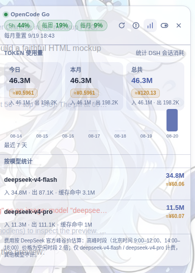

<div align="center">

# dsh-plugin-balance

**DeepSeek Harness Web 的 LLM 额度 / 用量悬浮窗 —— 附带 DSH 会话 token 用量与费用统计。**

[简体中文](#-简体中文) · [English](README.md)

</div>

> **简体中文** · [English README](README.md)

---

## ✨ 项目介绍

`dsh-plugin-balance` 是一个 DSH（DeepSeek Harness）Web 插件，在**输入框正上方**显示一个小悬浮窗，可以：

- **查询 LLM 账户余额 / 套餐用量**：支持 DeepSeek 官方、**OpenCode Go**、OpenAI，以及任意自定义额度接口。
- **OpenCode Go**：主窗口直接显示 **5h / 每周 / 每月** 三个用量百分比徽章（按用量高低自动变色：绿 → 黄 → 红）。
- **DSH 会话 token 用量统计**：你的 DSH 对话一共消耗了多少 token，按 **每天 / 每月 / 总共** 累计，并**按模型**拆分，持久化到磁盘。
- **费用估算**：按 DeepSeek 官方峰谷价对 token 用量估算费用。

悬浮窗可拖动、自动适配亮/暗主题，折叠成小胶囊后仍保留**刷新按钮**。

## 🖼 预览



## 功能一览

| 模块 | 说明 |
| --- | --- |
| 账户类型 | DeepSeek 官方（`/user/balance`）、**OpenCode Go**（经宿主代理查 `/usage`）、OpenAI `credit_grants`，或从 DSH 模型列表同步的**自定义额度接口** |
| OpenCode Go 展示 | 主行显示 5h / 每周 / 每月 百分比徽章；折叠胶囊只显示百分比；明细面板带重置时间 |
| Token 用量 | 今日 / 本月 / 总共 的 token 数、最近 7 天迷你柱状图、**按模型**拆分（入 / 出 / 缓存命中） |
| 费用估算 | `≈¥` 徽章（DeepSeek 官方峰谷价；高峰 = 空闲 × 2，北京时间 9:00–12:00、14:00–18:00；仅 `deepseek-v4-flash` / `deepseek-v4-pro` 计费） |
| 交互 | 可拖动并记住位置、点外部折叠、适配主题、胶囊内也有刷新按钮 |

## 🚀 以插件形式安装

插件已发布到 **npm**（`dsh-plugin-balance`）并带 `dsh.bundle` manifest，可直接用 DSH 标准插件命令安装：

```bash
dsh plugin add dsh-plugin-balance           # 默认 profile
# 或显式指定 Web profile：
dsh plugin --profile web add dsh-plugin-balance
```

> 该命令会解析 npm 包、写入 bundle 条目并启用插件。重启 `dsh web`（或热重载）后刷新浏览器页面即可。

### 手动安装（自己改 profile）

如果自己管理 profile（如离线环境 / 无 `dsh` CLI）：

1. 在 Web profile 的 `package.json`（如 `~/.dsh/profiles/web/package.json`）中加入依赖（可用 npm 版本、tarball 或本地路径）：

   ```json
   "dependencies": {
     "dsh-plugin-balance": "1.2.0"
   }
   ```

2. 在 `cordis.patch.yml` 中启用（包内已自带同样内容的 `cordis.patch.yml`）：

   ```yaml
   - insert:
       - id: plugin-balance
         name: dsh-plugin-balance
   ```

3. 安装并重启：

   ```bash
   cd ~/.dsh/profiles/web
   pnpm install
   # 重启 `dsh web`，然后刷新浏览器页面
   ```

> 需要 `webServer` 与 `credentials` 服务（web profile 的 `@deepseek-ai/dsh-web-app` 已提供）。主进程半依赖 `credentials`、`webServer`、`llm`、`settings`、`sessions`。

## ⚙️ 使用说明

点击**开关按钮**打开设置：

- **DeepSeek 官方余额**：Key 可留空（自动使用 DSH 的 `DEEPSEEK_API_KEY`），也可在浏览器填写（存于 `localStorage`）；支持自定义 `/user/balance` 基地址。
- **OpenCode Go 套餐用量**：无需填写，自动读取 DSH 凭据 `OPENCODE_GO_API_KEY`（缺省回退 `OPENCODE_API_KEY`）。
- **自定义额度接口**：可从 DSH 模型列表选厂商（自动带出 `baseURL` 与 `apiKeyEnv`），或手动填；密钥由宿主解析，不会发给浏览器。

点击**柱状图按钮**打开「TOKEN 使用量」面板：今日 / 本月 / 总共 + 最近 7 天柱状图 + 按模型统计 + 费用徽章。

## 🧮 Token 用量与费用

主进程半监听 DSH 会话事件流（`session/event`），把每次请求上报的 token 用量（输入 + 缓存写、缓存命中、输出）按 **日期 / 月份 / 模型** 折叠累计，并持久化到 `~/.dsh/storages/dsh-plugin-balance-usage.json`。

- 幂等：同一 `turn:step` 的新样本替换旧样本；重载 / 重启后重放日志不会重复计数。
- 提供给前端：`GET /api/dsh-plugin-balance/tokens`。
- 费用按 DeepSeek 官方定价计（`deepseek-v4-flash` / `deepseek-v4-pro`），按每个样本的发生时刻计价（详见界面内提示）。

## 📄 许可证

[BSD-3-Clause](LICENSE)
